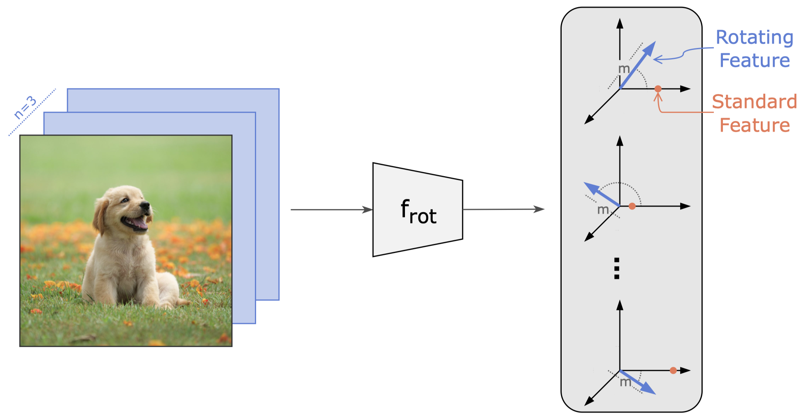

# Rotating Features for Object Discovery

Our proposed Rotating Features learn to represent object affiliation via their orientation on real-world data without labels. 
We achieve this by extending standard features by an extra dimension across the entire architecture.
We then set up the layer structure in such a way that the Rotating Features’ magnitudes learn to represent the presence
of features, while their orientations learn to represent object affiliation.
This allows us to achieve strong object discovery performance on real-world images in an unsupervised way.

This repository contains the code for the
paper [Rotating Features for Object Discovery](https://arxiv.org/abs/2306.00600) by Sindy Löwe, Phillip Lippe, Francesco
Locatello and Max Welling.




## Setup

- Install [conda](https://www.anaconda.com/products/distribution)
- Adjust the ```setup_environment.sh``` script to your needs (e.g. by setting the right CUDA version)
- Run the setup script:

```bash
bash setup_environment.sh
```

- Run the download script to download the 4Shapes datasets, FoodSeg103 and Pascal VOC 2012:

```bash
bash download_data.sh
```

## Run Experiments

- Train and evaluate an autoencoding model with Rotating Features on the provided datasets:

```bash
source activate RotatingFeatures
python -m codebase.main +experiment=4Shapes
```

```bash
python -m codebase.main +experiment=4Shapes_RGBD
```

```bash
python -m codebase.main +experiment=FoodSeg
```

```bash
python -m codebase.main +experiment=Pascal
```

## Citation

When using this code, please cite our paper:

```
@article{lowe2023rotating,
  title={Rotating Features for Object Discovery},
  author={L{\"o}we, Sindy and Lippe, Phillip and Locatello, Francesco and Welling, Max},
  journal={Advances in Neural Information Processing Systems (NeurIPS)},
  year={2023}
}
```

## Contact

For questions and suggestions, feel free to open an issue on GitHub or send an email
to [loewe.sindy@gmail.com](mailto:loewe.sindy@gmail.com).
